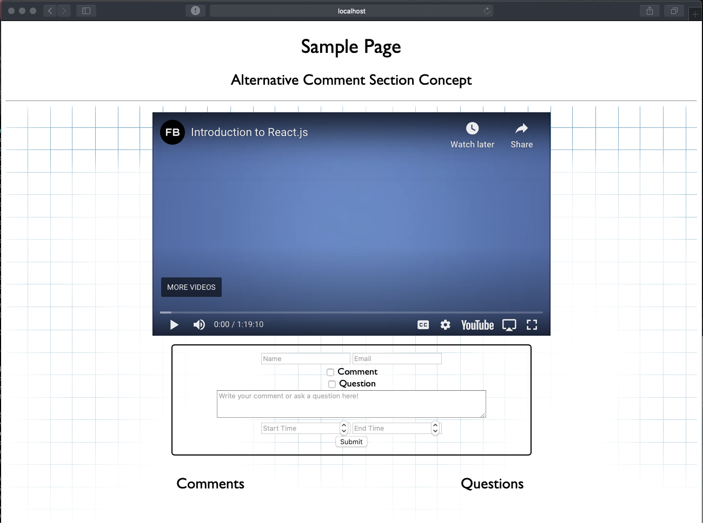

# Shoulders
## An Alternative Comment System for Learning

I developed this alternative comment system in hopes of helping tutorial and educational videos.  Here are some common setbacks you might encounter while using videos to learn:

> Updates have made this section of the tutorial hard to follow...

> This topic is so specific...how do I find a suitable StackOverflow answer?

> This topic is so generic...how do I find a suitable StackOverflow answer?

> I'm using a different version...will this still work?

Have you encountered similar problems?  This comment system strives to help you avoid some of these woes.  Comments are submitted with start and end times and only appear during that interval.  This single-page application is designed to demonstrate basic functionality and can be easily adapted for other websites.  

- **Flow:** When users encounter problems or have questions, relevant information is already close by and comments are already filtered.  If one has to search for help, finding the perfect keywords can be difficult and time-consuming.  Instead of having to continually jump around (which might be harmful to your workflow), this systems lets you start as close to the source as possible. 
- **Focus:** At the moment, comments refresh when the video is paused.  It may be helpful to refresh automatically, but a constant stream of comments might be distracting.  Even when comments are refreshed, only the most relevant ones are shown.
- **Collaborate:** This comment system strives to help you better connect with the same community of learners, including some who have struggled through and have resolved the exact problem that you're currently working on.

[YouTube link to see this comment system in action](https://www.youtube.com/watch?v=-axWHBeDJPY)

## Features I Would Love to Add

Here are some features this project would benefit greatly from.  
- **Question/Comment rating system** heavily inspired by Reddit and StackExchange to help users quickly get to quality questions and comments.  Additionally, a rating system would help moderate comments with poorly chosen timestamps.
- **Ability to reply to questions** for better organization.
- **Live updates** for a comment system more similar to livestream chat replays.
- **An *All* section** for those who want to see all user-provided content in one place.
- **Code Style Changes** 

## Learn With Me!
This comment system project was essentially my first foray into web development.  At the moment, I have not taken any web development courses from my school.  If you're looking at this project with a similar background and hoping to make something like this (or better!), here are some resources that helped me.

- [Mozilla's Intro WebDev Documentation (JavaScript, HTML, and some CSS)](https://developer.mozilla.org/en-US/docs/Learn/Getting_started_with_the_web/JavaScript_basics)
- [Introduction to Using React](https://reactjs.org/docs/getting-started.html)
- [Introduction to Using Django](https://docs.djangoproject.com/en/3.1/intro/tutorial01/)
- [react-youtube](https://www.npmjs.com/package/react-youtube)
- [Combining React & Django](https://www.valentinog.com/blog/drf/)